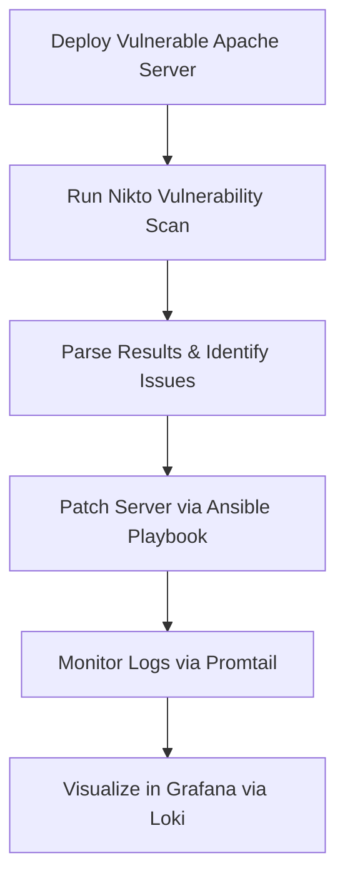

# Vulnerable Web Server Scan & Patch Automation POC

This Proof of Concept demonstrates how to:
1. Set up a vulnerable Apache web server.
2. Scan the server using the Nikto tool.
3. Automatically patch the vulnerabilities using Ansible.
4. Monitor server logs using Grafana, Loki, and Promtail.

## Project Workflow



---

## Folder Structure

- `ansible/`: Contains Ansible playbooks to install, scan, and patch the server.
- `files/`: Apache configuration files (vulnerable and patched versions).
- `grafana/`: Docker Compose files for Loki, Promtail, and Grafana.
- `nikto_results/`: Output folder for Nikto scans.
- `grafana_logs/`: Optional folder for logs if needed.

---

## Setup Instructions

### 1. Prerequisites

- An Ubuntu/Debian machine or VM
- Docker & Docker Compose installed
- Ansible installed: `sudo apt install ansible`
- Nikto installed: `sudo apt install nikto`

### 2. Deploy Vulnerable Apache Server

```bash
cd ansible
ansible-playbook install_vuln_web.yml -i "target_ip," --user your_user --ask-become-pass
```

### 3. Scan with Nikto

Edit `scan_with_nikto.yml` and replace `<target_ip>` with your target server IP.

```bash
ansible-playbook scan_with_nikto.yml
```

### 4. Patch Apache Server

```bash
ansible-playbook patch_server.yml -i "target_ip," --user your_user --ask-become-pass
```

---

## Grafana + Loki Monitoring

### Start Monitoring Stack

```bash
cd grafana
docker-compose up -d
```

- Grafana: `http://localhost:3000` (admin/admin)
- Loki: `http://localhost:3100`
- Promtail is configured to scrape Apache logs from `/var/log/apache2/*.log`

---

## Automation Ideas

You can create a shell script or cron job to:
- Run scans daily
- Patch based on findings
- Restart services
- Push logs to Loki

Or integrate with Jenkins or GitHub Actions to trigger on push or PR.

---

## Author

GitHub: [maleksakir](https://github.com/maleksakir)
